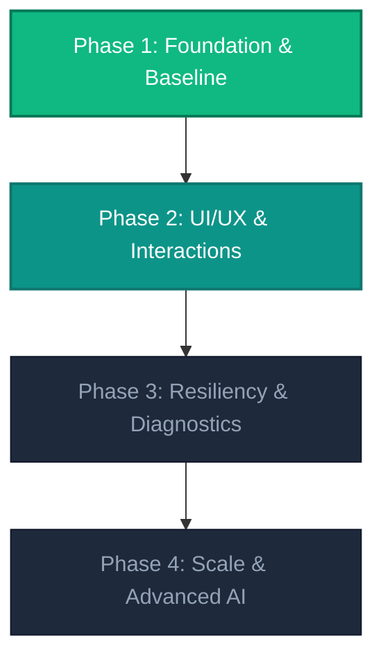

# DermaScan: Development Roadmap

This document outlines the milestones and timeline of feature developments for the DermaScan platform, detailing completed baselines, ongoing improvements, and future iterations.

---

## Roadmap Milestones

---

## Phase Breakdown

### Phase 1: Core Foundation & Multi-Portal Baselines (Current)
* [x] **Deep Learning Backend**: Integrate multi-task ResNet-18 model pipeline for skin classification.
* [x] **Authentication & Role Guards**: Establish Firebase Auth and database-level role verification (`admin`, `patient`, `dermat`).
* [x] **Patient Control Center**: Implement scan uploading and automatic ingredient lookup engine.
* [x] **Clinical Workspace**: Build case queues with real-time Firestore sync and detailed patient history timelines.
* [x] **Administrative Console**: Design pending application reviews for doctor registration management.

### Phase 2: UI/UX & Interaction Enhancements (Target)
* [ ] **Loading & Transition Feedback**: Standardize dynamic loaders and skeleton containers across all panels.
* [ ] **Biometric Targeting Interface**: Refine the visual targeting frame in the webcam/image upload component.
* [ ] **Historical Telemetry Visualization**: Render charts mapping patient skin condition progression over time.
* [ ] **Mobile Interface Optimizations**: Adapt admin tables and grid layouts to align cleanly on all mobile form factors.

### Phase 3: Resiliency & System Diagnostics (Planned)
* [ ] **Offline Mode Fallbacks**: Handle disconnected states with informative UI placeholders when Firestore is unavailable.
* [ ] **Secure Storage Integrations**: Ensure images are uploaded to verified Firebase Storage buckets, backed by Google Cloud CORS rules.
* [ ] **Robust Backend Validation**: Implement size checks and format validation on incoming image streams in Flask.

### Phase 4: Production Scale & Advanced AI (Future)
* [ ] **Cloud Deployment**: Host the Flask backend via containerized microservices (e.g., Google Cloud Run) and host the React app on Firebase Hosting.
* [ ] **Model Upgrades**: Train on larger datasets and expand predictions to handle additional skin conditions.
* [ ] **Telemetry Export**: Allow patients to export summaries of their scan logs and medical prescriptions.
